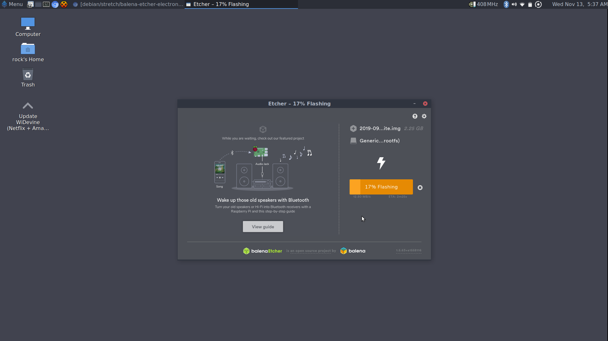

# balena-etcher-arm
## Balena Etcher untuk Raspberry Pi 4, PineBook Pro dan perangkat Arm lainnya
Built from source - https://github.com/balena-io/etcher
### [Build Instructions](etcher-build/README.md)
## Install memakai apt-get
### Package Repository - https://packagecloud.io/swift-arm/etcher
Cara menambah repository
```
curl -s https://packagecloud.io/install/repositories/swift-arm/etcher/script.deb.sh | sudo bash
```
Install balena Etcher
```
sudo apt-get install balena-etcher-electron
```

### Install secara manual
```
wget <deb package>
sudo apt install ./<deb package>
```
##
<b>Tested Devices</b>
- Raspberry Pi 4 - Raspbian Buster
- PineBook Pro - Debian Stretch
- Asus Tinkerboard - Tinker OS (Debian Stretch)
##



